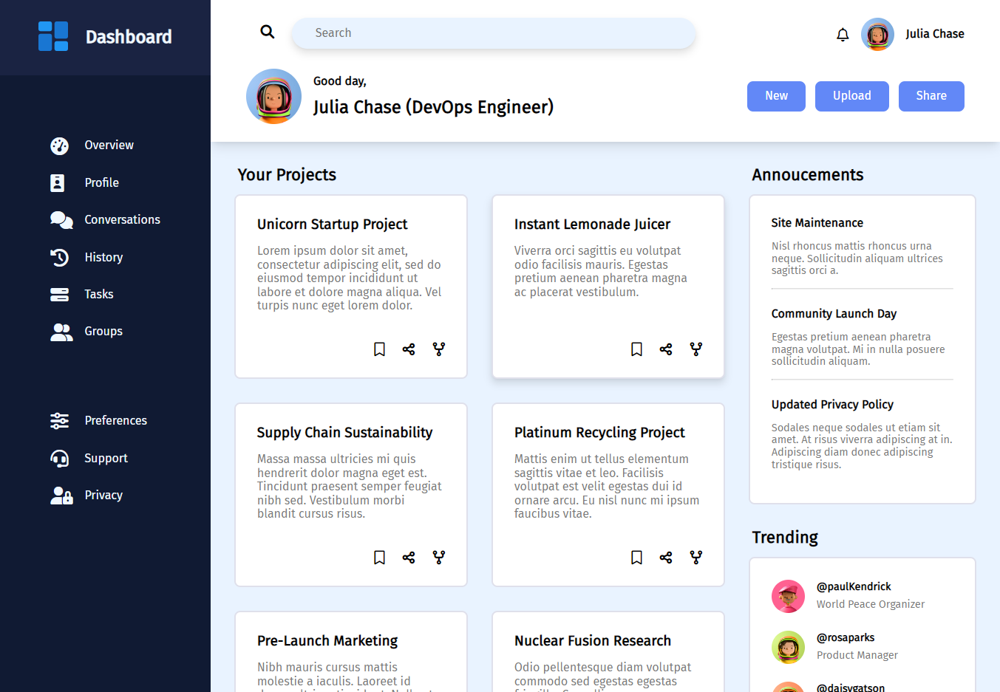

# Capstone Project #2 - Admin Dashboard

This is a responsive Admin Dashboard implemented with CSS Grid and Flexbox.

## Live Preview

This project is hosted on **GitHub Pages**. Feel free to [:point_right: try it out](https://raineedust.github.io/capstone-admin-dashboard/)!

## Motivation and Goals

- [x] Implement overall layout with Grid.
- [x] Implement sectional layouts.
- [x] Implement buttons, pictures, lists.
- [x] Implement avatars.
- [x] Implement shadow and button animation.
- [x] Use Flexbox or Grid based on context.
- [x] Utilize functions like `minmax()`, `clamp()` to improve grid responsiveness.
- [x] Add interactive elements and greetings to header.
- [x] Implement card-like layouts.
- [x] Tone down card description contrast.
- [x] Make it pretty!

## Limitations

- Sidebar is not hidden when viewport is small.

## Resources

Below are a collection of resources which helped improve my skills :sparkles: while building the project:

- [Cannot include node_modules - Help - Jekyll Talk](https://talk.jekyllrb.com/t/cannot-include-node-modules/3975/5)
- [Font Awesome Intro](https://www.w3schools.com/icons/fontawesome_icons_intro.asp)
- [css - How do I remove the default link color of the html hyperlink 'a' tag? - Stack Overflow](https://stackoverflow.com/questions/6722467/how-do-i-remove-the-default-link-color-of-the-html-hyperlink-a-tag)
- [css - CSS3 Transition Ease in and out Box Shadow - Stack Overflow](https://stackoverflow.com/questions/16163922/css3-transition-ease-in-and-out-box-shadow)
- [How To Style the HR Element with CSS](https://www.w3schools.com/howto/howto_css_style_hr.asp)
- [Practical Uses of CSS Math Functions: calc, clamp, min, max | Modern CSS Solutions](https://moderncss.dev/practical-uses-of-css-math-functions-calc-clamp-min-max/)
- [CSS Grid vs. Flexbox: Which Should You Use and When?](https://webdesign.tutsplus.com/articles/flexbox-vs-css-grid-which-should-you-use--cms-30184)
- [html - Create a circle avatar from a rectangle image keeping proportions and just using centre of image - Stack Overflow](https://stackoverflow.com/questions/26681059/create-a-circle-avatar-from-a-rectangle-image-keeping-proportions-and-just-using)
- [Advanced Grid Properties | The Odin Project](https://www.theodinproject.com/lessons/node-path-intermediate-html-and-css-advanced-grid-properties)

Built with :heart: to [The Odin Project](https://www.theodinproject.com/), a wonderful Web Development curriculum ~

## Acknowledgements

- [Icons designed by Pixel perfect](https://www.flaticon.com/authors/pixel-perfect)
- [Lorem Ipsum – Generator, Origins and Meaning](https://loremipsum.io/)
- [Font Awesome](https://fontawesome.com/)
